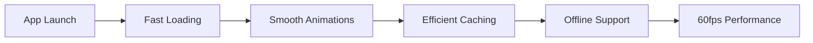
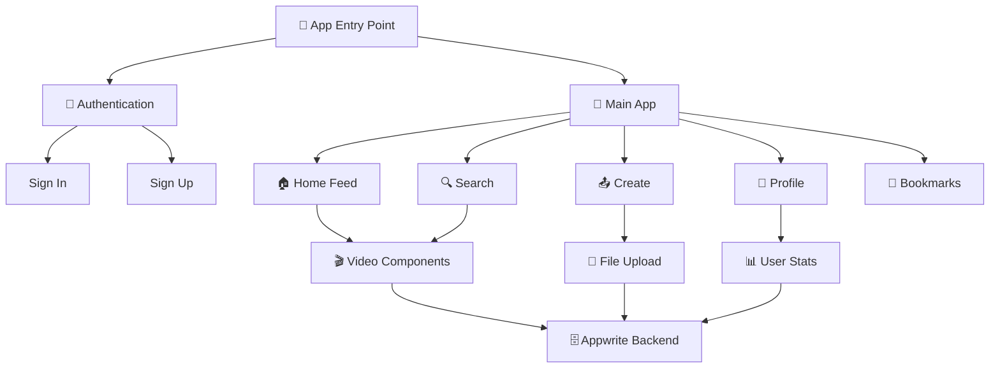

<div align="center">
  
</div>

<h1 align="center">
  
  Aora - Professional Video Sharing Platform
</h1>

<div align="center">

  [](https://reactnative.dev/)
  [](https://expo.dev/)
  [](https://tailwindcss.com/)
  [](https://appwrite.io/)

  [](https://opensource.org/licenses/MIT)
  [](http://makeapullrequest.com)
  [](https://github.com/tauhee56/aora-video-sharing-app/stargazers)

</div>

<div align="center">
  <h3>
    
    A cutting-edge video sharing platform built with React Native
  </h3>
  <p><em>Discover, share, and explore AI-generated videos in a beautifully designed mobile experience</em></p>
</div>

<div align="center">

  [📱 Features](#-features) •
  [🛠️ Tech Stack](#️-tech-stack) •
  [🚀 Quick Start](#-quick-start) •
  [📖 Documentation](#-documentation) •
  [🤝 Contributing](#-contributing)

</div>

---

<div align="center">
  
  <p><em>Experience the future of video sharing</em></p>
</div>

---

## 📱 About Aora

<table>
<tr>
<td width="50%">

**Aora** is a revolutionary mobile application that transforms the way we share and discover video content. Built with cutting-edge technologies and featuring an elegant, professional design, Aora provides creators and viewers with an intuitive platform for AI-generated video content.

Our platform combines the power of **React Native** for cross-platform compatibility, **Appwrite** for robust backend services, and **modern design principles** to deliver an exceptional user experience.

</td>
<td width="50%">

```javascript
const aora = {
  platform: "Mobile (iOS & Android)",
  framework: "React Native + Expo",
  backend: "Appwrite",
  styling: "NativeWind (Tailwind CSS)",
  features: [
    "AI Video Sharing",
    "Real-time Search",
    "User Authentication",
    "Media Management",
    "Professional UI/UX"
  ]
}
```

</td>
</tr>
</table>

### ✨ Why Choose Aora?

<div align="center">

| 🎨 **Modern Design** | 🔐 **Secure & Reliable** | 📱 **Cross-Platform** | ⚡ **High Performance** |
|:---:|:---:|:---:|:---:|
| Professional UI with glass-morphism effects | End-to-end encryption & secure authentication | Native iOS & Android experience | Optimized for 60fps smooth animations |
| **🎬 AI Integration** | **🔍 Smart Search** | **📊 Analytics** | **🌟 Community** |
| Specialized for AI-generated content | Real-time search with instant results | Detailed user insights & statistics | Active community of creators |

</div>

---

## 🛠️ Tech Stack

<div align="center">

### Frontend Technologies
<table>
<tr>
<td align="center" width="25%">

<br><strong>React Native</strong>
<br><em>Cross-platform mobile framework</em>
</td>
<td align="center" width="25%">

<br><strong>Expo</strong>
<br><em>Development platform & tools</em>
</td>
<td align="center" width="25%">

<br><strong>NativeWind</strong>
<br><em>Tailwind CSS for React Native</em>
</td>
<td align="center" width="25%">

<br><strong>Animatable</strong>
<br><em>Smooth animations</em>
</td>
</tr>
</table>

### Backend & Services
<table>
<tr>
<td align="center" width="33%">

<br><strong>Appwrite</strong>
<br><em>Backend-as-a-Service</em>
</td>
<td align="center" width="33%">

<br><strong>Database</strong>
<br><em>Document-based storage</em>
</td>
<td align="center" width="33%">

<br><strong>Storage</strong>
<br><em>File management system</em>
</td>
</tr>
</table>

### Development Tools
```bash
📦 Package Manager    → npm/yarn
🔧 Development       → Expo CLI
📱 Testing          → Expo Go
🎨 Styling          → NativeWind (Tailwind CSS)
🔍 Code Quality     → ESLint + Prettier
📊 Version Control  → Git + GitHub
```

</div>

---

## 🌟 Features

<div align="center">
  
</div>

### 🎯 Core Functionality

<table>
<tr>
<td width="50%">

#### 📱 **User Experience**
- **🎨 Onboarding Journey**: Interactive welcome screens with smooth animations
- **🔐 Secure Authentication**: Email-based login with robust security
- **🏠 Dynamic Home Feed**: AI-curated video content with trending algorithms
- **🔍 Smart Search**: Real-time search with autocomplete and filters
- **📊 User Profiles**: Comprehensive profiles with analytics and insights

</td>
<td width="50%">

#### 🎬 **Content Management**
- **📤 Easy Upload**: Drag-and-drop video and thumbnail upload
- **�️ Video Player**: Native controls with quality selection
- **💾 Cloud Storage**: Secure file storage with CDN delivery
- **📈 Analytics**: Detailed view counts and engagement metrics
- **🏷️ Tagging System**: AI-powered content categorization

</td>
</tr>
</table>

### 🎨 Design Excellence

<div align="center">

| Feature | Description | Technology |
|---------|-------------|------------|
| 🌙 **Dark Theme** | Professional dark mode with glass-morphism effects | NativeWind + Custom CSS |
| ✨ **Animations** | 60fps smooth transitions and micro-interactions | React Native Animatable |
| 📱 **Responsive** | Adaptive design for all screen sizes | Flexible layouts |
| 🎯 **Navigation** | Intuitive tab-based navigation with haptic feedback | React Navigation |
| 🎨 **Gradients** | Beautiful gradient overlays and visual effects | Custom styling |

</div>

### ⚡ Performance & Optimization



- **🚀 Lightning Fast**: Optimized app startup under 2 seconds
- **🔄 Smart Refresh**: Pull-to-refresh with intelligent data fetching
- **💾 Intelligent Caching**: Offline-first approach with smart sync
- **📱 Native Performance**: Hardware-accelerated animations
- **🔋 Battery Optimized**: Efficient resource management

---

## 🚀 Quick Start

<div align="center">
  
</div>

### 📋 Prerequisites

<table>
<tr>
<td width="50%">

#### 🛠️ **Required Tools**
```bash
✅ Node.js (v16+)
✅ npm or yarn
✅ Git
✅ Expo CLI
✅ Code Editor (VS Code recommended)
```

</td>
<td width="50%">

#### 📱 **For Device Testing**
```bash
📱 iOS: Xcode (macOS only)
🤖 Android: Android Studio
📲 Physical Device: Expo Go app
```

</td>
</tr>
</table>

### ⚡ Installation

<details>
<summary><b>🔽 Step-by-step Installation Guide</b></summary>

#### 1️⃣ **Clone the Repository**
```bash
# Clone the project
git clone https://github.com/tauhee56/aora-video-sharing-app.git

# Navigate to project directory
cd aora-video-sharing-app
```

#### 2️⃣ **Install Dependencies**
```bash
# Using npm
npm install

# Or using yarn
yarn install

# Install Expo CLI globally (if not installed)
npm install -g @expo/cli
```

#### 3️⃣ **Environment Setup**
Create a `.env` file in the root directory:

```env
# Appwrite Configuration
EXPO_PUBLIC_APPWRITE_ENDPOINT=https://cloud.appwrite.io/v1
EXPO_PUBLIC_APPWRITE_PLATFORM=com.tauhee.aora
EXPO_PUBLIC_APPWRITE_PROJECT_ID=your_project_id
EXPO_PUBLIC_APPWRITE_DATABASE_ID=your_database_id
EXPO_PUBLIC_APPWRITE_USER_COLLECTION_ID=your_user_collection_id
EXPO_PUBLIC_APPWRITE_VIDEO_COLLECTION_ID=your_video_collection_id
EXPO_PUBLIC_APPWRITE_STORAGE_ID=your_storage_id
```

#### 4️⃣ **Start Development Server**
```bash
# Start the Expo development server
npm start

# Or with yarn
yarn start
```

#### 5️⃣ **Run on Device**
```bash
# iOS Simulator (macOS only)
npm run ios

# Android Emulator
npm run android

# Web Browser
npm run web
```

</details>

### 🎯 Quick Commands

```bash
# 🚀 Start development server
npm start

# 📱 Run on iOS (macOS only)
npm run ios

# 🤖 Run on Android
npm run android

# 🌐 Run on web
npm run web

# 🧹 Clear cache
npm start -- --clear
```

---

## 📁 Project Structure

<div align="center">
  
</div>

<details>
<summary><b>🗂️ Detailed Project Structure</b></summary>

```
📦 aora-video-sharing-app/
├── 📱 app/                          # Main application screens
│   ├── 🔐 (auth)/                   # Authentication flow
│   │   ├── sign-in.jsx              # Login screen
│   │   ├── sign-up.jsx              # Registration screen
│   │   └── _layout.jsx              # Auth layout wrapper
│   ├── 📑 (tabs)/                   # Tab navigation screens
│   │   ├── home.jsx                 # Home feed screen
│   │   ├── profile.jsx              # User profile screen
│   │   ├── create.jsx               # Video upload screen
│   │   ├── bookmark.jsx             # Saved videos screen
│   │   └── _layout.jsx              # Tab layout wrapper
│   ├── 🔍 search/                   # Search functionality
│   │   └── [query].jsx              # Dynamic search results
│   ├── index.jsx                    # Welcome/onboarding screen
│   └── _layout.jsx                  # Root layout wrapper
├── 🧩 components/                   # Reusable UI components
│   ├── CustomButton.jsx             # Multi-variant button component
│   ├── FormField.jsx                # Enhanced input field
│   ├── VideoCard.jsx                # Video display card
│   ├── SearchInput.jsx              # Search input component
│   ├── Trending.jsx                 # Trending videos carousel
│   ├── EmptyState.jsx               # Empty state component
│   ├── InfoBox.jsx                  # Information display box
│   ├── Loader.jsx                   # Loading spinner
│   └── index.js                     # Component exports
├── 🎨 constants/                    # App constants & configurations
│   ├── icons.js                     # Icon imports
│   ├── images.js                    # Image imports
│   └── index.js                     # Constants exports
├── 🌐 context/                      # React Context providers
│   └── GlobalProvider.js            # Global state management
├── 📚 lib/                          # Utility functions & API calls
│   ├── appwrite.js                  # Appwrite backend integration
│   └── useAppwrite.js               # Custom hooks for data fetching
├── 🖼️ assets/                       # Static assets
│   ├── fonts/                       # Custom fonts (Poppins family)
│   ├── icons/                       # App icons
│   └── images/                      # App images
├── ⚙️ Configuration Files
│   ├── tailwind.config.js           # Tailwind CSS configuration
│   ├── babel.config.js              # Babel configuration
│   ├── app.json                     # Expo app configuration
│   ├── package.json                 # Dependencies & scripts
│   └── .gitignore                   # Git ignore rules
└── 📖 README.md                     # Project documentation
```

</details>

### 🏗️ Architecture Overview



---

## 🎨 Design System

<div align="center">
  
</div>

### 🌈 Color Palette

<div align="center">

<table>
<tr>
<td align="center">
<div style="width: 60px; height: 60px; background: #0F0F23; border-radius: 50%; margin: 0 auto;"></div>
<strong>Primary</strong><br>
<code>#0F0F23</code><br>
<em>Deep Navy Blue</em>
</td>
<td align="center">
<div style="width: 60px; height: 60px; background: #6366F1; border-radius: 50%; margin: 0 auto;"></div>
<strong>Secondary</strong><br>
<code>#6366F1</code><br>
<em>Modern Indigo</em>
</td>
<td align="center">
<div style="width: 60px; height: 60px; background: #10B981; border-radius: 50%; margin: 0 auto;"></div>
<strong>Accent</strong><br>
<code>#10B981</code><br>
<em>Emerald Green</em>
</td>
<td align="center">
<div style="width: 60px; height: 60px; background: #F59E0B; border-radius: 50%; margin: 0 auto;"></div>
<strong>Warning</strong><br>
<code>#F59E0B</code><br>
<em>Amber</em>
</td>
</tr>
</table>

</div>

### 🔤 Typography System

<table>
<tr>
<td width="50%">

#### **Font Family: Poppins**
```css
/* Font Weights Available */
font-family: 'Poppins', sans-serif;

pthin: 100        /* Ultra Light */
pextralight: 200  /* Extra Light */
plight: 300       /* Light */
pregular: 400     /* Regular */
pmedium: 500      /* Medium */
psemibold: 600    /* Semi Bold */
pbold: 700        /* Bold */
pextrabold: 800   /* Extra Bold */
pblack: 900       /* Black */
```

</td>
<td width="50%">

#### **Typography Scale**
```css
/* Heading Hierarchy */
h1: 2.5rem (40px) - pbold
h2: 2rem (32px) - psemibold
h3: 1.5rem (24px) - pmedium
h4: 1.25rem (20px) - pmedium

/* Body Text */
Large: 1.125rem (18px) - pregular
Base: 1rem (16px) - pregular
Small: 0.875rem (14px) - plight
XSmall: 0.75rem (12px) - plight
```

</td>
</tr>
</table>

### 🎭 Design Principles

<div align="center">

| Principle | Description | Implementation |
|-----------|-------------|----------------|
| **🌙 Dark-First** | Professional dark theme with light accents | Primary dark backgrounds with strategic light elements |
| **✨ Glass-morphism** | Modern frosted glass effects | Backdrop blur with subtle transparency |
| **🎯 Minimalism** | Clean, focused interface design | Generous whitespace and clear visual hierarchy |
| **📱 Mobile-First** | Optimized for mobile experience | Touch-friendly interactions and responsive layouts |
| **⚡ Performance** | 60fps smooth animations | Hardware-accelerated transitions |

</div>

---

## 🔧 Configuration

### Appwrite Setup

1. **Create Appwrite Project**
   - Visit [Appwrite Console](https://cloud.appwrite.io/)
   - Create a new project
   - Note your Project ID

2. **Configure Database**
   - Create a new database
   - Create collections for users and videos
   - Set up appropriate permissions

3. **Configure Storage**
   - Create a storage bucket
   - Configure file upload permissions
   - Set file size limits

4. **Configure Authentication**
   - Enable email/password authentication
   - Configure session settings
   - Set up security rules

---

## 🤝 Contributing

We welcome contributions! Please follow these steps:

1. **Fork the repository**
2. **Create a feature branch**
   ```bash
   git checkout -b feature/amazing-feature
   ```
3. **Commit your changes**
   ```bash
   git commit -m 'Add some amazing feature'
   ```
4. **Push to the branch**
   ```bash
   git push origin feature/amazing-feature
   ```
5. **Open a Pull Request**

### Development Guidelines
- Follow the existing code style
- Write meaningful commit messages
- Add tests for new features
- Update documentation as needed

---

## 📄 License

This project is licensed under the MIT License - see the [LICENSE](LICENSE) file for details.

---

## 🙏 Acknowledgments

- **React Native Team** - For the amazing framework
- **Expo Team** - For the excellent development tools
- **Appwrite Team** - For the powerful backend services
- **Tailwind CSS** - For the utility-first CSS framework

---

## 📞 Support

If you have any questions or need help:

- 📧 **Email**: tauheedjunior@gmail.com
- 📖 **Documentation**: [For Full Documentation Contact us]

---

<div align="center">
  <p>Made with ❤️ by Tauheed</p>
  <p>⭐ Star this repo if you found it helpful!</p>
</div>
# aora-video-sharing-app

